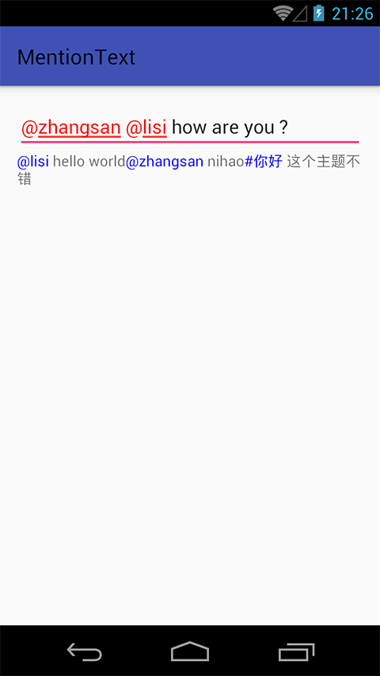

# MentionText
高亮@信息，常见于聊天应用@某人，微博标注某事件
#Usage
集成新特性很简单，不需要修改之前的逻辑及代码，如下：

### EditText

简单集成

` MentionText.from().apply(editText);`

自定义匹配符号

`MentionText.from("@").apply(editText);`

自定义匹配符号及颜色

`MentionText.from("@|#", 0xFF0000FF).apply(editText);`

###TextView
同EditText

### 效果图

### TODO

- custom color

